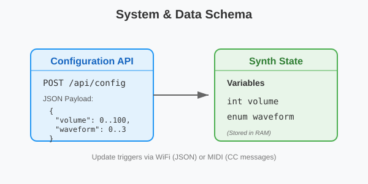

# BolokoSynth

BolokoSynth is a modular, ESP32-based polyphonic synthesizer ecosystem. It features high-quality audio generation using the ESP32 AudioKit, optional OLED visualization, and a web-based configuration portal. The project also includes dedicated USB Host sub-projects (for ESP32-S2 and S3) to bridge USB MIDI controllers to the main synthesizer via hardware Serial.

## Project Purpose

The goal of BolokoSynth is to provide a flexible and extensible platform for digital sound synthesis on low-cost hardware. It demonstrates:
- Real-time wavetable synthesis (Sine, Triangle, Square, Sawtooth).
- Hardware-accelerated audio output using I2S and external Codecs.
- Multi-core processing for UI/Audio separation.
- Remote configuration via WiFi and a Web API.
- USB MIDI integration via dedicated companion modules.

## Repository Structure

- `audio-synth-a1s/`: The main synthesizer firmware designed for the AI-Thinker ESP32 AudioKit.
- `usb-host-s2-ttgo/`: Companion firmware for ESP32-S2 (e.g., LilyGO TTGO) to act as a USB MIDI Host with display.
- `usb-host-s3/`: Minimal companion firmware for ESP32-S3 to act as a USB MIDI Host.
- `schema.svg`: Architectural overview of the system.

---

## 1. Main Synthesizer (`audio-synth-a1s`)

### Setup & Requirements
- **Hardware**: ESP32 AudioKit (Board V2.2 A1S recommended).
- **Display**: SSD1306 128x64 I2C OLED (Optional).
- **Libraries**:
  - `arduino-audiokit`: Low-level driver for the AudioKit.
  - `Adafruit SSD1306` & `GFX`: For OLED visualization.
  - `WiFiManager`: For captive portal WiFi setup.
  - `ArduinoJson`: For Web API communication.

### Execution Flow: How it Starts
1. **Entry Point (`setup()` in `main.cpp`)**:
    - Initializes Serial debugging and `Serial2` for MIDI input (31250 baud).
    - Configures the `AudioKit` hardware (Sample rate: 44.1kHz, 16-bit).
    - Calls `webManager.begin()`:
        - Loads persistent settings (MIDI channel, CC mappings) from NVS (`Preferences`).
        - Starts `WiFiManager` to connect to a known network or start an Access Point (`ESP32-Synth-AP`).
        - Starts the `WebServer` on port 80.
    - Spawns the `displayTask` on **Core 0** using FreeRTOS. This ensures display updates don't interrupt audio generation.
2. **The Audio Loop (`loop()` in `main.cpp`)**:
    - **Web Services**: Calls `webManager.handle()` to process any pending HTTP requests.
    - **MIDI Processing**: Checks `Serial2`. If data is present, it parses status and data bytes, forwarding them to `handleMidiMessage()`.
    - **Synthesis**:
        - `handleMidiMessage()` updates the `Synth` object (Note On/Off, Volume, Waveform).
        - The loop generates a 64-sample stereo buffer by calling `synth.getSample()`.
        - The buffer is written to the `AudioKit` (I2S) for immediate playback.

### Usage
- **WiFi Config**: Connect to `ESP32-Synth-AP` to set up your local WiFi. Once connected, visit the IP shown on the OLED or Serial monitor to access the web dashboard.
- **Web Dashboard**: Adjust volume, waveform, MIDI channel, and custom CC mappings for Volume and Waveform parameters.
- **MIDI Control**: Connect a MIDI source to the defined RX/TX pins (default GPIO 22/23).

---

## 2. USB MIDI Hosts

These companion projects allow you to use modern USB MIDI controllers with the synthesizer.

### `usb-host-s2-ttgo`
- **Purpose**: Acts as a bridge between a USB MIDI keyboard and the Main Synth.
- **Features**: Displays connection status on the built-in ST7789 TFT screen.
- **Wiring**: Connect USB D+/D- to the ESP32-S2 and UART TX to the Main Synth MIDI RX.

### `usb-host-s3`
- **Purpose**: High-performance USB Host bridge using the ESP32-S3.
- **Logic**: It listens for USB MIDI packets and forwards them as standard Serial MIDI messages to the main unit.

---

## Contribution Guidelines

1. **Bug Fixes**: Ensure any fix for the synthesis engine is tested for latency regressions.
2. **New Waveforms**: Implement new waveforms in `Synth.h` within the `getSample()` method.
3. **Hardware Ports**: If porting to a new Audio board, update the `AUDIOKIT_BOARD` define in `platformio.ini`.
4. **Code Style**:
    - Use descriptive comments for all public methods.
    - Keep audio generation logic lightweight; avoid blocking calls in the main loop.
    - UI/Display logic should always run in a separate FreeRTOS task on Core 0.

---

## License
[Insert License Here - e.g., MIT]